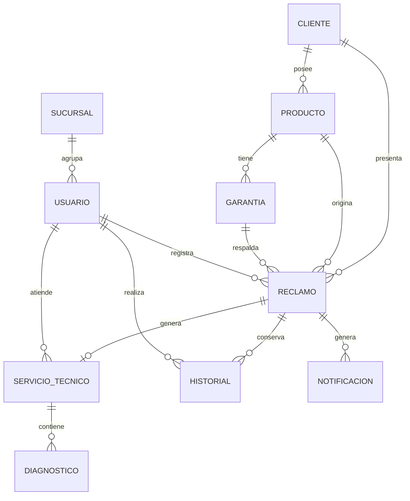

\newpage

# Presentación del proyecto
Proyecto académico orientado al análisis y diseño conceptual de un sistema de gestión de reclamos, garantías y servicio técnico para Gollo Respaldo.

## Objetivo
Diseñar una solución que permita registrar reclamos, validar garantías, asignar órdenes al taller, actualizar diagnósticos, consultar estados y enviar notificaciones automáticas a los clientes.

## Integrantes
- Steven Miranda Esquivel
- Andrew Barrantes James
- Osman Gomez Jarquin
- Cristel Quesada González

## Estructura del proyecto

```text
Gollo-respaldo-as2/
├── README.md
├── .gitignore
├── Docs/
│   └── Proyecto_Final_AS2-Fase2.pdf
├── Fase1/
│   ├── analisis_negocio.md
│   ├── diagrama_proceso.png
│   ├── requerimientos_actores.md
│   └── planificacion_fase1.md
└── Fase2/
    ├── backlog_sprints.md
    ├── diagrama_uml_vista_general.png
    ├── diagrama_uml_actores_funciones.png
    ├── modelo_er.md
    ├── diccionario_datos.md
    ├── Mockups/
    │   └── mockups_funcionales.md
    └── RFC/
        ├── RFC-001.md
        └── RFC-002.md
```


\newpage

# Análisis del Negocio

**Proyecto:** Sistema de Gestión de Garantías “Gollo Respaldo”  
**Responsable:** Andrew Barrantes James  
**Fase:** 1  

---

## Introducción

En la actualidad, las empresas dedicadas a la comercialización de electrodomésticos y artículos tecnológicos requieren sistemas de información que les permitan gestionar de forma eficiente los procesos relacionados con la atención al cliente.

Uno de estos procesos es la administración de garantías, el cual implica el registro, seguimiento y resolución de las solicitudes presentadas por los clientes.

El presente proyecto propone el desarrollo de un sistema de gestión de garantías para Gollo, con el propósito de mejorar el control de las solicitudes, reducir los tiempos de respuesta y facilitar el seguimiento de cada caso.

La implementación de este sistema permitirá centralizar la información, optimizar el trabajo de los colaboradores y brindar un mejor servicio a los clientes.

---

## Objetivo general

Diseñar y desarrollar un sistema de gestión de garantías para Gollo que permita registrar, administrar y dar seguimiento a las solicitudes de garantía de los clientes, optimizando los procesos internos y mejorando la calidad del servicio.

---

## Justificación

Actualmente, el proceso de gestión de garantías puede presentar dificultades relacionadas con el seguimiento de los casos, el acceso a la información y la comunicación entre las diferentes áreas involucradas.

El desarrollo de un sistema especializado permitirá automatizar gran parte del proceso, reducir errores administrativos, mantener un historial de cada garantía y facilitar la consulta del estado de cada solicitud.

Además, el sistema contribuirá a mejorar la experiencia del cliente al ofrecer una gestión más rápida, organizada y eficiente.

---

## Alcance

El sistema permitirá administrar el proceso completo de garantías, desde el registro inicial hasta el cierre del caso.

Las principales funcionalidades incluyen:

- Registro de clientes.
- Registro de productos.
- Registro de solicitudes de garantía.
- Consulta del estado de cada solicitud.
- Asignación de técnicos.
- Registro del diagnóstico.
- Actualización del estado del servicio.
- Reparación o reemplazo del producto, según corresponda.
- Almacenamiento del historial de garantías.
- Administración de usuarios.
- Generación de reportes básicos.

### Dentro del alcance

- Análisis y documentación del sistema.
- Diseño conceptual de la solución.
- Levantamiento de requerimientos funcionales y no funcionales.
- Definición de actores y roles.
- Historias de usuario con criterios de aceptación.
- Diagramas UML.
- Estimaciones mediante Planning Poker y PERT.
- Planificación Scrum.
- Product Backlog y planificación de sprints.
- Mockups funcionales.
- Modelo entidad-relación.
- Diccionario de datos.
- Gestión de cambios mediante RFC.
- Repositorio Git con control de versiones.

### Fuera del alcance

- Desarrollo de código fuente funcional.
- Implementación de una base de datos operativa.
- Hosting o despliegue en servidores.
- Pruebas formales de software.
- Diseño gráfico avanzado o branding.
- Integración con APIs externas reales.
- Reparación física de productos.
- Transporte de productos.
- Procesos de venta y facturación.
- Administración del inventario general.
- Contabilidad y compras.

---

## Ficha de la empresa

| Campo | Detalle |
|---|---|
| **Empresa** | Gollo |
| **Actividad** | Venta de electrodomésticos, tecnología, muebles, línea blanca, motocicletas y productos para el hogar |
| **Sector** | Comercio minorista |
| **Ubicación** | Sucursales en todo Costa Rica |
| **Servicios** | Venta de productos, financiamiento, servicio postventa, garantías y atención al cliente |
| **Necesidad identificada** | Mejorar la gestión y el seguimiento de las garantías mediante un sistema informático |

---

## Problema actual

El proceso actual de gestión de garantías presenta dificultades para localizar la información de los clientes y productos, conocer el estado de las solicitudes, mantener un historial centralizado y coordinar la comunicación entre asesores y técnicos.

Estas limitaciones pueden generar:

- Retrasos en la atención.
- Errores administrativos.
- Información desactualizada.
- Dificultades para dar seguimiento a los casos.
- Problemas de comunicación entre áreas.
- Disminución en la calidad del servicio al cliente.

---

## Gestión actual de garantías

El proceso de gestión de garantías se desarrolla mediante las siguientes etapas:

1. Recepción de la solicitud del cliente.
2. Verificación de la factura de compra.
3. Validación de la garantía.
4. Registro del producto.
5. Envío del producto al área técnica.
6. Diagnóstico del producto.
7. Reparación o reemplazo, según corresponda.
8. Comunicación del resultado al cliente.
9. Entrega del producto al cliente.

---

## Procesos dentro del sistema

El sistema permitirá realizar las siguientes funciones:

- Inicio de sesión de usuarios.
- Administración de usuarios.
- Registro de clientes.
- Registro de productos.
- Registro de solicitudes de garantía.
- Validación de garantías.
- Asignación de técnicos.
- Registro de diagnósticos.
- Actualización del estado de las solicitudes.
- Consulta del historial de garantías.
- Búsqueda de información.
- Envío de notificaciones.
- Generación de reportes básicos.

---

## Procesos fuera del sistema

Las siguientes actividades no serán administradas directamente por el sistema:

- Reparación física de los productos.
- Transporte de los productos.
- Proceso de ventas.
- Facturación.
- Administración del inventario general.
- Contabilidad.
- Compras.

---

## Beneficios esperados

La implementación del sistema permitirá obtener los siguientes beneficios:

- Mayor rapidez en la atención de las garantías.
- Reducción de errores administrativos.
- Centralización de la información.
- Seguimiento de solicitudes en tiempo real.
- Mejor comunicación entre asesores y técnicos.
- Historial completo de cada garantía.
- Generación de reportes para la toma de decisiones.
- Mayor control sobre los tiempos de atención.
- Mayor satisfacción de los clientes.

---

## Identificación de la solución

Se propone el análisis y diseño conceptual de un **Sistema de Gestión de Reclamos y Servicio Técnico para “Gollo Respaldo”**, orientado a mejorar el proceso de atención de garantías extendidas y brindar una mayor trazabilidad durante el ciclo de servicio de los productos.

La solución consiste en una plataforma centralizada con módulos para:

- Gestión de reclamos.
- Validación de garantías.
- Seguimiento de órdenes de servicio.
- Asignación de técnicos.
- Actualización de diagnósticos.
- Control de estados.
- Consulta de historial.
- Envío de notificaciones.
- Generación de reportes.

---

## Identificación de stakeholders

Los principales interesados en el proyecto son:

| Stakeholder | Tipo | Interés principal |
|---|---|---|
| **Cliente** | Externo | Obtener una respuesta rápida y conocer el estado de su garantía |
| **Asesor de Tienda** | Interno | Registrar y validar correctamente las solicitudes |
| **Técnico del Taller** | Interno | Consultar casos y actualizar diagnósticos y estados |
| **Administrador del Sistema** | Interno | Supervisar el servicio, administrar usuarios y resolver casos especiales |
| **Gerencia** | Interno | Consultar indicadores para la toma de decisiones |
| **Sistema de Notificaciones** | Externo, no humano | Enviar avisos automáticos al cliente |

---

## Evaluación de riesgos

Durante el desarrollo del proyecto pueden presentarse diferentes riesgos que afecten el cumplimiento de los objetivos.

| Riesgo | Posible consecuencia | Medida de prevención |
|---|---|---|
| Retrasos en el desarrollo | Incumplimiento de fechas | Planificar tareas y revisar periódicamente el avance |
| Cambios en los requerimientos | Modificación del alcance | Documentar los cambios mediante una RFC |
| Pérdida de información | Retrabajo o pérdida de avances | Realizar respaldos y utilizar control de versiones |
| Errores durante el desarrollo | Fallos en el sistema | Aplicar revisiones y pruebas continuas |
| Resistencia al cambio | Baja adopción por parte de los usuarios | Capacitar a los usuarios finales |
| Problemas con el servidor | Interrupción del servicio | Definir mecanismos de respaldo y recuperación |
| Falta de comunicación en el equipo | Duplicación de tareas o inconsistencias | Realizar reuniones breves de seguimiento |

---

## Conclusión

El análisis realizado evidencia la necesidad de contar con un sistema centralizado para mejorar la gestión de garantías de Gollo Respaldo.

La propuesta permitirá organizar la información, facilitar el seguimiento de los casos, mejorar la comunicación entre las áreas involucradas y brindar al cliente una atención más rápida, clara y eficiente.

## Diagrama del proceso

{ width=95% }


\newpage

# Requerimientos y Actores

**Sistema de Gestión de Reclamos y Servicio Técnico para “Gollo Respaldo”**

Este documento define los actores del sistema, sus responsabilidades, los requerimientos funcionales y no funcionales, y las historias de usuario asociadas al proyecto.

---

## Actores y roles

| Actor | Tipo | Objetivo principal |
|---|---|---|
| **Cliente** | Primario, externo | Resolver su falla y conocer el estado del caso sin tener que llamar o visitar la tienda |
| **Asesor de Tienda** | Primario, interno | Recibir la solicitud, validar la garantía y derivar correctamente el caso |
| **Técnico del Taller** | Primario, interno | Diagnosticar el producto y mantener actualizado el estado de la orden durante todas sus etapas |
| **Administrador del Sistema** | Primario, interno | Administrar la plataforma, supervisar el servicio y resolver casos escalados |
| **Sistema de Notificaciones** | Secundario, sistema | Informar automáticamente al Cliente sobre cambios de estado y alertas relevantes |

La nomenclatura de estos actores fue unificada con los diagramas UML mediante la RFC-001.

---

## Descripción detallada de los actores

### Cliente

Persona que adquirió un producto con garantía extendida Gollo Respaldo y necesita reportar una falla o dar seguimiento a su caso.

**Responsabilidades:**

- Solicitar la aplicación de la garantía.
- Reportar la falla al Asesor de Tienda.
- Consultar el estado de su reclamo o reparación.
- Recibir notificaciones automáticas.

**Restricciones:**

- No registra directamente el reclamo en el sistema.
- No valida la procedencia de la garantía.
- No diagnostica ni repara productos.
- No accede a casos de otros clientes.
- No consulta reportes administrativos.

### Asesor de Tienda

Colaborador de la sucursal y primer punto de contacto con el Cliente. Recibe la solicitud, valida la garantía y direcciona el caso.

**Responsabilidades:**

- Recibir y registrar la solicitud del Cliente.
- Validar vigencia, cobertura y condiciones de la garantía.
- Crear el expediente o ticket de servicio.
- Asignar el caso al taller cuando la garantía es válida.
- Escalar el caso al Administrador del Sistema cuando la garantía no es válida.
- Informar al Cliente sobre el resultado de la validación.

**Restricciones:**

- No diagnostica ni repara productos.
- No resuelve casos escalados.
- No administra usuarios, roles o permisos.
- No configura catálogos del sistema.

### Técnico del Taller

Encargado de diagnosticar el producto y mantener actualizado el estado de la orden durante su ciclo de atención: **Ingresado → En Taller → Reparado → Entregado**.

**Responsabilidades:**

- Consultar los casos asignados.
- Registrar y actualizar el diagnóstico.
- Actualizar el estado de la orden.
- Registrar información sobre la reparación.
- Generar el evento que activa las notificaciones al Cliente.

**Restricciones:**

- No valida garantías.
- No resuelve casos escalados por garantía inválida.
- No gestiona usuarios ni permisos.
- No configura el sistema.

### Administrador del Sistema

Responsable de la operación general de la plataforma, la supervisión del servicio y la resolución de situaciones especiales.

**Responsabilidades:**

- Gestionar usuarios, roles y permisos.
- Configurar catálogos del sistema.
- Revisar y resolver casos escalados.
- Cerrar casos una vez resuelta la situación.
- Consultar el historial completo de los reclamos.
- Controlar tiempos de atención.
- Reasignar casos cuando sea necesario.
- Consultar indicadores y generar reportes.

**Restricciones:**

- No diagnostica ni repara productos.
- No atiende directamente al Cliente en la sucursal.

### Sistema de Notificaciones

Servicio externo no humano, como correo electrónico o SMS, utilizado para mantener informado al Cliente.

**Responsabilidades:**

- Enviar notificaciones ante cambios de estado.
- Enviar alertas por vencimientos próximos.
- Registrar errores cuando una notificación no puede enviarse.

**Restricciones:**

- No toma decisiones.
- No valida información.
- No modifica reclamos ni diagnósticos.
- Solo ejecuta los envíos solicitados por el sistema.

---

## Catálogo de requerimientos funcionales

| ID | Requerimiento funcional | Actor(es) | Prioridad | Trazabilidad |
|---|---|---|---|---|
| **RF-01** | El sistema debe permitir al Asesor de Tienda registrar un reclamo de garantía sobre un producto comprado por el Cliente | Asesor de Tienda | Alta (Must) | GOL-01 / HU2 |
| **RF-02** | El sistema debe permitir al Cliente consultar en tiempo real el estado de su reclamo o reparación | Cliente | Alta (Must) | GOL-02 / HU1 |
| **RF-03** | El sistema debe permitir al Asesor de Tienda validar si la garantía reportada está vigente y es procedente | Asesor de Tienda | Alta (Must) | HU8 / UML |
| **RF-04** | El sistema debe permitir al Asesor de Tienda generar un ticket de servicio y asignarlo al taller cuando la garantía es válida | Asesor de Tienda, Técnico del Taller | Alta (Must) | HU8 / UML |
| **RF-05** | El sistema debe permitir al Asesor de Tienda escalar el caso al Administrador del Sistema cuando la garantía no es válida | Asesor de Tienda, Administrador del Sistema | Alta (Must) | HU8 / HU9 |
| **RF-06** | El sistema debe permitir al Técnico del Taller registrar y actualizar el diagnóstico del producto | Técnico del Taller | Alta (Must) | GOL-03 / HU3 |
| **RF-07** | El sistema debe permitir al Técnico del Taller actualizar el estado de la orden en sus etapas: Ingresado, En Taller, Reparado y Entregado | Técnico del Taller | Alta (Must) | GOL-04 / HU7 |
| **RF-08** | El sistema debe enviar una notificación automática por correo electrónico o SMS al Cliente cada vez que cambie el estado de su caso | Sistema de Notificaciones, Cliente | Media (Should) | GOL-05 / HU5 |
| **RF-09** | El sistema debe permitir al Administrador del Sistema revisar y resolver los casos escalados por garantía inválida | Administrador del Sistema | Media (Should) | HU9 / UML |
| **RF-10** | El sistema debe permitir al Administrador del Sistema cerrar un caso una vez resuelta la situación | Administrador del Sistema | Alta (Must) | HU9 |
| **RF-11** | El sistema debe permitir al Administrador del Sistema gestionar usuarios, roles y permisos de asesores y técnicos | Administrador del Sistema | Baja (Could) | GOL-07 / HU4 |
| **RF-12** | El sistema debe permitir al Administrador del Sistema configurar catálogos como tipos de falla, sucursales y SLA de garantía | Administrador del Sistema | Baja (Could) | Tabla de problemáticas |
| **RF-13** | El sistema debe permitir al Administrador del Sistema consultar el historial completo de acciones de un reclamo para fines de auditoría | Administrador del Sistema | Media (Should) | GOL-06 / HU6 |
| **RF-14** | El sistema debe generar reportes e indicadores de desempeño del servicio técnico | Administrador del Sistema | Baja (Could) | HU10 |
| **RF-15** | El sistema debe controlar los tiempos de garantía y emitir alertas ante vencimientos próximos | Sistema de Notificaciones, Administrador del Sistema | Media (Should) | Tabla de problemáticas |

---

## Catálogo de requerimientos no funcionales

| ID | Requerimiento no funcional | Categoría | Métrica verificable |
|---|---|---|---|
| **RNF-01** | El sistema debe responder a las consultas de estado en tiempos aceptables bajo carga normal | Rendimiento | Tiempo de respuesta menor o igual a 3 segundos con hasta 200 usuarios concurrentes |
| **RNF-02** | La plataforma debe estar disponible durante el horario de atención | Disponibilidad | Disponibilidad igual o superior al 99 % entre las 8:00 y las 18:00, de lunes a sábado |
| **RNF-03** | El acceso debe estar controlado según el perfil del usuario | Seguridad | Autenticación obligatoria y control de acceso basado en roles |
| **RNF-04** | La información sensible debe protegerse en tránsito y en reposo | Seguridad | Uso de TLS 1.2 o superior y cifrado de datos sensibles en la base de datos |
| **RNF-05** | El registro de un reclamo debe ser fácil de utilizar para personal nuevo | Usabilidad | Un Asesor de Tienda nuevo completa el registro en un máximo de 5 minutos |
| **RNF-06** | El sistema debe soportar el crecimiento esperado de reclamos | Escalabilidad | Soporta un crecimiento anual del 20 % sin degradar el RNF-01 |
| **RNF-07** | Cada cambio de estado debe quedar registrado de forma inmodificable | Trazabilidad y auditoría | Bitácora con fecha, hora y usuario responsable, sin opción de edición o eliminación |
| **RNF-08** | El portal del Cliente debe funcionar desde distintos dispositivos | Compatibilidad | Diseño responsive en Chrome, Edge y Safari, tanto en escritorio como en móvil |
| **RNF-09** | Las notificaciones automáticas deben llegar oportunamente | Confiabilidad | Tiempo máximo de 5 minutos entre el cambio de estado y el envío |

---

## Resumen de historias de usuario

| ID | Actor | Historia | Prioridad | Story Points |
|---|---|---|---|---|
| **HU1** | Cliente | Consultar estado | Alta (Must) | 3 |
| **HU2** | Asesor de Tienda | Registrar reclamo | Alta (Must) | 5 |
| **HU3** | Técnico del Taller | Actualizar diagnóstico | Alta (Must) | 8 |
| **HU4** | Administrador del Sistema | Administrar usuarios | Baja (Could) | 5 |
| **HU5** | Sistema de Notificaciones | Enviar notificaciones | Media (Should) | 3 |
| **HU6** | Administrador del Sistema | Consultar historial | Media (Should) | 5 |
| **HU7** | Técnico del Taller | Cambiar estado de la orden | Alta (Must) | 8 |
| **HU8** | Asesor de Tienda | Validar garantía | Alta (Must) | 5 |
| **HU9** | Administrador del Sistema | Resolver casos escalados | Media (Should) | 5 |
| **HU10** | Administrador del Sistema | Generar reportes de desempeño | Baja (Could) | 5 |

---

## Historias de usuario y criterios de aceptación

### HU1 — Consultar estado

**Como** Cliente de Gollo Respaldo,
**deseo** consultar el estado de mi garantía en tiempo real mediante una plataforma web,
**para** no tener que llamar o visitar la sucursal.

**Criterios de aceptación:**

- Dado un número de reclamo válido, cuando el Cliente lo ingresa, el sistema muestra el estado actual en menos de 3 segundos.
- Dado un número inexistente o incorrecto, el sistema muestra un mensaje claro sin exponer datos de otros clientes.
- La consulta muestra la fecha del último cambio de estado.

### HU2 — Registrar reclamo

**Como** Asesor de Tienda,
**deseo** registrar un reclamo en formato digital,
**para** eliminar la duplicidad de datos en sistemas aislados.

**Criterios de aceptación:**

- Al completar los campos obligatorios, el sistema genera un número de reclamo único.
- Si falta información obligatoria, el sistema impide guardar y señala los campos faltantes.
- El reclamo queda disponible para consulta y validación inmediatamente después del registro.

### HU3 — Actualizar diagnóstico

**Como** Técnico del Taller,
**deseo** registrar y actualizar el diagnóstico de reparación,
**para** que la información esté disponible inmediatamente.

**Criterios de aceptación:**

- El diagnóstico se guarda con fecha, hora y Técnico responsable.
- Las actualizaciones conservan el historial de versiones anteriores.
- Cada actualización puede activar una notificación al Cliente.

### HU4 — Administrar usuarios

**Como** Administrador del Sistema,
**deseo** gestionar usuarios, roles y permisos,
**para** garantizar la seguridad de la información.

**Criterios de aceptación:**

- Cada usuario nuevo recibe un rol definido.
- Un usuario desactivado no puede iniciar sesión.
- Todo cambio de permisos queda registrado en la bitácora.

### HU5 — Enviar notificaciones

**Como** Sistema de Notificaciones,
**deseo** enviar mensajes automáticos cuando cambie el estado del artículo,
**para** mantener informado al Cliente.

**Criterios de aceptación:**

- La notificación se envía en un máximo de 5 minutos.
- Si el envío falla, el sistema registra el error sin detener el reclamo.
- El mensaje incluye número de reclamo, estado actual y fecha.

### HU6 — Consultar historial

**Como** Administrador del Sistema,
**deseo** consultar el historial completo de un reclamo,
**para** auditar tiempos de respuesta y desempeño.

**Criterios de aceptación:**

- El historial muestra los cambios en orden cronológico.
- Cada registro incluye fecha, hora y responsable.
- La información no puede editarse ni eliminarse.
- Se puede filtrar por fechas o Técnico.

### HU7 — Cambiar estado de la orden

**Como** Técnico del Taller,
**deseo** actualizar el estado de la orden,
**para** mantener la trazabilidad completa del proceso.

**Criterios de aceptación:**

- No se permiten saltos inválidos entre estados.
- Cada cambio se registra en el historial.
- Cada cambio activa la notificación correspondiente.
- Para marcar un producto como Reparado debe existir un diagnóstico previo.

### HU8 — Validar garantía

**Como** Asesor de Tienda,
**deseo** validar la vigencia y cobertura de la garantía,
**para** decidir si genero un ticket o escalo el caso.

**Criterios de aceptación:**

- El sistema muestra la vigencia y cobertura de la garantía.
- Si la garantía es válida, se genera un ticket y se asigna al taller.
- Si no es válida, se escala al Administrador del Sistema indicando el motivo.

### HU9 — Resolver casos escalados

**Como** Administrador del Sistema,
**deseo** revisar y resolver casos escalados por garantía inválida,
**para** dar una respuesta formal al Cliente.

**Criterios de aceptación:**

- El Administrador puede consultar el motivo de escalamiento.
- La resolución queda registrada.
- El Cliente recibe una notificación con el resultado.
- El caso puede cerrarse una vez resuelto.

### HU10 — Generar reportes de desempeño

**Como** Administrador del Sistema,
**deseo** generar reportes e indicadores del servicio técnico,
**para** identificar cuellos de botella y tiempos de respuesta.

**Criterios de aceptación:**

- El reporte incluye tiempo promedio de respuesta, reclamos por estado y casos escalados.
- Los reportes pueden exportarse en PDF o Excel.
- Cuando no hay datos, el sistema muestra un mensaje claro.

---

## Regla transversal de trazabilidad

Cada cambio de estado debe registrar:

- Fecha.
- Hora.
- Usuario responsable.
- Estado anterior.
- Estado nuevo.

Además, cada cambio puede generar una notificación automática para el Cliente.


\newpage

# Planificación del Proyecto — Fase 1

**Proyecto:** Sistema de Gestión de Garantías “Gollo Respaldo”  
**Responsable:** Osman Gomez Jarquin  
**Metodología:** Scrum  

> **Nota de trazabilidad:** esta sección conserva la planificación base elaborada en la Fase 1. La distribución definitiva de historias y sprints se presenta posteriormente en la sección **Backlog y Planificación de Sprints** de la Fase 2.

---

## Introducción

La planificación del proyecto se desarrolla bajo la metodología Scrum, incorporando estimaciones, priorización de historias de usuario, organización por sprints, gestión de cambios, estrategia de control de versiones y evaluación de riesgos.

El propósito es organizar el trabajo de forma iterativa, controlar los cambios del alcance y facilitar la entrega progresiva de las funcionalidades del sistema.

---

## Objetivo de la planificación

Planificar el desarrollo del Sistema de Gestión de Garantías “Gollo Respaldo” de forma incremental, priorizando las funcionalidades de mayor valor para el negocio y estableciendo mecanismos para medir el esfuerzo, controlar los cambios y reducir los riesgos del proyecto.

---

## Metodología Scrum

Scrum permite dividir el trabajo en períodos cortos llamados **sprints**, dentro de los cuales se desarrollan y revisan grupos de funcionalidades.

La metodología propuesta contempla:

- Product Backlog.
- Priorización MoSCoW.
- Historias de usuario.
- Estimación mediante Planning Poker.
- Estimaciones PERT.
- Planificación de sprints.
- Seguimiento mediante reuniones breves.
- Gestión formal de cambios.
- Control de versiones con Git.

---

## Estimación mediante Planning Poker

Para estimar el esfuerzo de las historias de usuario se utiliza la escala Fibonacci:

**1, 2, 3, 5, 8, 13**

| Historia | Descripción | Story Points |
|---|---|---:|
| **HU1** | Consultar estado | 3 |
| **HU2** | Registrar reclamo | 5 |
| **HU3** | Actualizar diagnóstico | 8 |
| **HU4** | Administrar usuarios | 5 |
| **HU5** | Enviar notificaciones | 3 |
| **HU6** | Consultar historial | 5 |
| **HU7** | Cambiar estado de la orden | 8 |

Los Story Points representan el esfuerzo relativo de cada historia, considerando complejidad, incertidumbre y cantidad de trabajo.

---

## Estimaciones PERT

Para estimar la duración esperada de algunas actividades se utiliza la fórmula:

```text
PERT = (O + 4M + P) / 6
```

Donde:

- **O:** estimación optimista.
- **M:** estimación más probable.
- **P:** estimación pesimista.

| Actividad | O | M | P | Estimación PERT |
|---|---:|---:|---:|---:|
| Registrar reclamo | 2 h | 4 h | 8 h | 4.3 h |
| Actualizar diagnóstico | 1 h | 3 h | 5 h | 3 h |
| Consultar garantía | 2 h | 3 h | 4 h | 3 h |

---

## Priorización del Product Backlog
Las historias de usuario se priorizan mediante la metodología **MoSCoW**:

- **Must have:** requisito indispensable.
- **Should have:** requisito importante, pero no crítico para la primera entrega.
- **Could have:** requisito deseable.
- **Won’t have:** requisito excluido temporalmente.

### Backlog inicial
| ID Jira | Módulo | Historia de usuario | Prioridad | SP | Impacto operativo |
|---|---|---|---|---:|---|
| **GOL-01** | Gestión de Reclamos | HU2: Registrar un reclamo en formato digital | Alta (Must) | 5 | Reduce errores del registro manual y centraliza la información |
| **GOL-02** | Seguimiento de Órdenes | HU1: Consultar el estado de la garantía en tiempo real | Alta (Must) | 3 | Reduce llamadas y visitas a la sucursal |
| **GOL-03** | Diagnósticos | HU3: Registrar y actualizar el diagnóstico | Alta (Must) | 8 | Evita información desactualizada sobre el producto |
| **GOL-04** | Seguimiento de Órdenes | HU7: Actualizar el estado de la orden | Alta (Must) | 8 | Mantiene la trazabilidad y el historial de cambios |
| **GOL-05** | Diagnósticos | HU5: Enviar notificaciones automáticas | Media (Should) | 3 | Mejora la comunicación entre tienda, taller y Cliente |
| **GOL-06** | Seguimiento de Órdenes | HU6: Consultar el historial completo del reclamo | Media (Should) | 5 | Facilita la auditoría y el control de tiempos |
| **GOL-07** | Control de Acceso | HU4: Gestionar usuarios, roles y permisos | Baja (Could) | 5 | Restringe el acceso según el perfil del usuario |

### Resumen por prioridad
| Prioridad | Elementos |
|---|---|
| **Alta** | Registrar reclamo, consultar estado, actualizar diagnóstico y cambiar estado |
| **Media** | Enviar notificaciones y consultar historial |
| **Baja** | Administrar usuarios y generar reportes KPI |

---

## Planificación de sprints
### Sprint 1 — Núcleo de Registro y Consulta Pública
**Objetivo:** implementar el Producto Mínimo Viable enfocado en registrar reclamos, permitir la consulta pública del estado y establecer el control de acceso inicial.

| Historia | Descripción | SP |
|---|---|---:|
| GOL-01 / HU2 | Registrar reclamo | 5 |
| GOL-02 / HU1 | Consultar estado | 3 |
| GOL-07 / HU4 | Administrar usuarios | 5 |
|  | **Total** | **13** |

### Sprint 2 — Gestión de Taller y Trazabilidad
**Objetivo:** digitalizar la operación del taller y permitir el seguimiento de las órdenes durante las distintas etapas de reparación.

| Historia | Descripción | SP |
|---|---|---:|
| GOL-03 / HU3 | Actualizar diagnóstico | 8 |
| GOL-04 / HU7 | Cambiar estado de la orden | 8 |
| GOL-05 / HU5 | Enviar notificaciones | 3 |
|  | **Total** | **19** |

### Sprint 3 — Auditoría, Reportes y Cierre
**Objetivo:** incorporar mecanismos de control, historial de cumplimiento, reportes e indicadores, además de realizar las pruebas integrales previas al cierre del proyecto.

| Elemento | Descripción | SP |
|---|---|---:|
| GOL-06 / HU6 | Consultar historial | 5 |
| Pruebas integrales | Validación general del sistema | Por estimar |
| Reportes KPI | Indicadores de desempeño | Por estimar |
| Ajustes finales | Corrección de incidencias y preparación de entrega | Por estimar |

---

## Gestión de cambios
Todo cambio solicitado durante el proyecto debe documentarse mediante una **Solicitud de Cambio o RFC**.

Cada RFC debe incluir:

- Número de solicitud.
- Persona solicitante.
- Fecha.
- Descripción del cambio.
- Justificación.
- Elementos afectados.
- Impacto estimado.
- Prioridad.
- Responsable.
- Decisión de aprobación o rechazo.
- Firmas de aprobación.

Los cambios aprobados que afecten el alcance pueden provocar que tareas de menor prioridad sean trasladadas a un sprint posterior.

---

## Estrategia de control de versiones
El repositorio utilizará un modelo de ramas jerárquico.

### Ramas principales
- **`main`:** contiene únicamente versiones estables y aprobadas.
- **`develop`:** integra el trabajo completado por el equipo.
- **`feature/`:** ramas temporales utilizadas para desarrollar historias o documentos específicos.

Ejemplo:

```text
feature/GOL-01-registro-reclamo
```

### Convención de commits
Los commits deben seguir una estructura descriptiva:

```text
tipo(alcance): descripción breve
```

Ejemplos:

```text
feat(reclamos): registrar modelo de datos para HU2
fix(seguimiento): corregir búsqueda por número de orden
docs(readme): añadir documentación del proyecto
docs(planificacion): agregar planificación de la fase 1
```

### Integración del trabajo
1. Crear una rama `feature/` desde `develop`.
2. Realizar los cambios correspondientes.
3. Crear commits descriptivos.
4. Subir la rama al repositorio remoto.
5. Crear un Pull Request hacia `develop`.
6. Solicitar revisión de otro integrante.
7. Fusionar los cambios aprobados.

---

## Riesgos de planificación
| Riesgo | Probabilidad | Impacto | Estrategia de mitigación |
|---|---|---|---|
| Cambios frecuentes en el alcance | Alta | Alto | Utilizar RFC y trasladar tareas de menor prioridad a otro sprint |
| Dependencias e incomunicación entre integrantes | Media | Alto | Realizar reuniones breves para identificar bloqueos |
| Conflictos o pérdida de información en Git | Alta | Medio | Utilizar Pull Requests y revisión por pares antes de fusionar |
| Falta de disponibilidad de usuarios clave | Media | Medio | Programar las revisiones con anticipación y compartir prototipos |
| Retrasos en las actividades | Media | Alto | Revisar el avance del sprint y reasignar tareas cuando sea necesario |

---

## Seguimiento del proyecto
El avance del proyecto debe revisarse periódicamente mediante:

- Revisión del Product Backlog.
- Seguimiento de historias completadas.
- Actualización de Story Points.
- Registro de bloqueos.
- Revisión de cambios aprobados.
- Validación de entregables al final de cada sprint.
- Evidencia de commits y Pull Requests.

---

## Conclusión
La planificación propuesta permite organizar el trabajo, priorizar las funcionalidades más importantes y controlar los cambios mediante Scrum. El uso de estimaciones, sprints, gestión de riesgos y control de versiones facilita el seguimiento del proyecto y reduce la posibilidad de pérdida de información o conflictos durante la integración.


\newpage

# Backlog y Planificación de Sprints
**Proyecto:** Sistema de Gestión de Garantías “Gollo Respaldo”  
**Fase:** 2  
**Metodología:** Scrum  

---

## Introducción
El presente documento tiene como propósito presentar la planificación del proyecto bajo la metodología Scrum, incluyendo el Product Backlog priorizado, la organización de las historias de usuario en un tablero de Jira o Trello y la planificación de los sprints.

Esta planificación permite organizar el trabajo de forma iterativa, priorizar las funcionalidades de mayor valor y facilitar el seguimiento del avance durante el desarrollo del Sistema de Gestión de Garantías “Gollo Respaldo”.

---

## Product Backlog Priorizado
| Prioridad | ID | Historia | Puntos de Historia | Estado |
|---|---|---|---:|---|
| Alta | HU2 | Registrar reclamo | 5 | Pendiente |
| Alta | HU1 | Consultar estado | 3 | Pendiente |
| Alta | HU3 | Actualizar diagnóstico | 8 | Pendiente |
| Alta | HU7 | Cambiar estado de la orden | 8 | Pendiente |
| Alta | HU8 | Validar garantía | 5 | Pendiente |
| Media | HU5 | Enviar notificaciones | 3 | Pendiente |
| Media | HU6 | Consultar historial | 5 | Pendiente |
| Media | HU9 | Resolver casos escalados | 5 | Pendiente |
| Baja | HU4 | Administrar usuarios | 5 | Pendiente |
| Baja | HU10 | Generar reportes KPI | 5 | Pendiente |

---

## Propuesta de Tablero Jira/Trello
### Backlog
- HU2 — Registrar reclamo.
- HU1 — Consultar estado.
- HU3 — Actualizar diagnóstico.
- HU7 — Cambiar estado.
- HU8 — Validar garantía.
- HU5 — Enviar notificaciones.
- HU6 — Consultar historial.
- HU9 — Resolver casos escalados.
- HU4 — Administrar usuarios.
- HU10 — Reportes KPI.

### Sprint 1
- HU2 — Registrar reclamo.
- HU1 — Consultar estado.
- HU8 — Validar garantía.

### Sprint 2
- HU3 — Actualizar diagnóstico.
- HU7 — Cambiar estado.
- HU5 — Enviar notificaciones.

### Sprint 3
- HU6 — Consultar historial.
- HU9 — Resolver casos escalados.
- HU4 — Administrar usuarios.
- HU10 — Reportes KPI.

### Columnas de seguimiento
- Pendiente.
- En progreso.
- En revisión.
- Completado.

---

## Planificación de Sprints
### Sprint 1 — Registro y Validación de Garantías
**Duración:** 2 semanas.

**Objetivo:** Desarrollar las funcionalidades esenciales que permitan registrar las solicitudes de garantía de los clientes, validar la vigencia y cobertura de la garantía y ofrecer una consulta del estado del reclamo.

Este sprint tiene como finalidad entregar un Producto Mínimo Viable (MVP) que permita iniciar el proceso de gestión de garantías de manera digital, eliminando registros manuales y mejorando la atención al cliente desde la primera interacción.

| Historia | Puntos de Historia |
|---|---:|
| HU2 — Registrar reclamo | 5 |
| HU1 — Consultar estado | 3 |
| HU8 — Validar garantía | 5 |
| **Total** | **13** |

---

### Sprint 2 — Gestión del Taller y Seguimiento de Órdenes
**Duración:** 2 semanas.

**Objetivo:** Implementar las funcionalidades relacionadas con el trabajo del taller técnico, permitiendo registrar y actualizar el diagnóstico de los productos, controlar el avance de cada orden de servicio mediante cambios de estado y mantener informado al cliente mediante notificaciones automáticas.

Con este sprint se busca garantizar la trazabilidad completa del proceso de reparación y mejorar la comunicación entre las áreas involucradas.

| Historia | Puntos de Historia |
|---|---:|
| HU3 — Actualizar diagnóstico | 8 |
| HU7 — Cambiar estado | 8 |
| HU5 — Notificaciones | 3 |
| **Total** | **19** |

---

### Sprint 3 — Administración, Auditoría y Cierre del Proyecto
**Duración:** 2 semanas.

**Objetivo:** Finalizar el desarrollo del sistema mediante la incorporación de las funcionalidades administrativas y de control, permitiendo gestionar usuarios y permisos, resolver casos escalados, consultar el historial completo de los reclamos y generar reportes de desempeño.

Además, durante este sprint se realizarán las pruebas integrales del sistema, la corrección de incidencias detectadas y la preparación del producto para su entrega final.

| Historia | Puntos de Historia |
|---|---:|
| HU6 — Historial | 5 |
| HU9 — Resolver casos escalados | 5 |
| HU4 — Administrar usuarios | 5 |
| HU10 — Reportes KPI | 5 |
| **Total** | **20** |

---

## Resumen de Carga por Sprint
| Sprint | Historias | Total de Puntos |
|---|---|---:|
| Sprint 1 | HU2, HU1, HU8 | 13 |
| Sprint 2 | HU3, HU7, HU5 | 19 |
| Sprint 3 | HU6, HU9, HU4, HU10 | 20 |
| **Total del proyecto** | **10 historias de usuario** | **52** |

---

## Observación
Se recomienda incluir la historia de usuario **HU8 — Validar garantía** en el Sprint 1, ya que es una funcionalidad de prioridad Alta y forma parte del proceso principal de gestión de garantías.

En su lugar, **HU4 — Administrar usuarios**, al ser de prioridad Baja, puede desarrollarse en un sprint posterior sin afectar el funcionamiento del Producto Mínimo Viable (MVP).

---

## Estado Inicial del Backlog
Al momento de crear esta planificación, todas las historias se encuentran en estado **Pendiente**. Durante el desarrollo deberán moverse entre las columnas del tablero según su progreso:

```text
Pendiente → En progreso → En revisión → Completado
```


\newpage

# Diagramas UML

## Vista general
{ width=88% }

## Relación entre actores y funciones
{ width=88% }


\newpage

# Modelo Entidad–Relación

**Proyecto:** Sistema de Gestión de Reclamos y Servicio Técnico para Gollo Respaldo  
**Responsable:** Andrew Barrantes James  
**Fase:** 2  

## Objetivo

Definir la estructura lógica para clientes, productos, garantías, reclamos, servicios técnicos, diagnósticos, historial y notificaciones.

Los perfiles internos se representan mediante **USUARIO**, cuyo campo `rol` distingue al Asesor de Tienda, Técnico del Taller y Administrador del Sistema.

## Entidades

### CLIENTE

`id_cliente` PK, `nombre`, `apellidos`, `cedula`, `telefono`, `correo`, `direccion`.

### SUCURSAL

`id_sucursal` PK, `nombre`, `provincia`, `direccion`.

### USUARIO

`id_usuario` PK, `nombre`, `apellidos`, `correo`, `contrasena_hash`, `rol`, `especialidad`, `activo`, `id_sucursal` FK.

### PRODUCTO

`id_producto` PK, `nombre`, `marca`, `modelo`, `numero_serie`, `fecha_compra`, `id_cliente` FK.

### GARANTIA

`id_garantia` PK, `fecha_inicio`, `fecha_vencimiento`, `cobertura`, `estado`, `id_producto` FK.

### RECLAMO

`id_reclamo` PK, `fecha_registro`, `motivo`, `descripcion`, `prioridad`, `estado`, `id_cliente` FK, `id_producto` FK, `id_garantia` FK, `id_asesor` FK.

> El Cliente reporta la falla; `id_asesor` identifica al Asesor de Tienda que realiza el registro.

### SERVICIO_TECNICO

`id_servicio` PK, `fecha_ingreso`, `fecha_salida`, `estado`, `id_reclamo` FK única, `id_tecnico` FK.

### DIAGNOSTICO

`id_diagnostico` PK, `descripcion`, `repuestos`, `costo_estimado`, `tiempo_estimado`, `fecha_registro`, `version`, `id_servicio` FK, `id_tecnico` FK.

La relación SERVICIO_TECNICO–DIAGNOSTICO es 1:N para conservar versiones anteriores.

### HISTORIAL

`id_historial` PK, `fecha_hora`, `accion`, `observaciones`, `estado_anterior`, `estado_nuevo`, `id_reclamo` FK, `id_responsable` FK.

### NOTIFICACION

`id_notificacion` PK, `tipo`, `destinatario`, `mensaje`, `fecha_envio`, `estado_envio`, `id_reclamo` FK.

## Relaciones

| Relación | Cardinalidad |
|---|---|
| CLIENTE — PRODUCTO | 1:N |
| PRODUCTO — GARANTIA | 1:N |
| CLIENTE — RECLAMO | 1:N |
| PRODUCTO — RECLAMO | 1:N |
| GARANTIA — RECLAMO | 1:N |
| SUCURSAL — USUARIO | 1:N |
| USUARIO — RECLAMO | 1:N |
| RECLAMO — SERVICIO_TECNICO | 1:0..1 |
| USUARIO — SERVICIO_TECNICO | 1:N |
| SERVICIO_TECNICO — DIAGNOSTICO | 1:N |
| RECLAMO — HISTORIAL | 1:N |
| USUARIO — HISTORIAL | 1:N |
| RECLAMO — NOTIFICACION | 1:N |

## Diagrama Mermaid



## Reglas

- `id_asesor` debe corresponder a un usuario con rol Asesor de Tienda.
- `id_tecnico` debe corresponder a un usuario con rol Técnico del Taller.
- Un reclamo inválido puede no generar servicio técnico.
- El historial no debe editarse ni eliminarse.
- El estado `Reparado` requiere al menos un diagnóstico.
- Toda notificación debe conservar su estado de envío.


\newpage

# Diccionario de Datos
**Proyecto:** Sistema de Gestión de Reclamos y Servicio Técnico para Gollo Respaldo  
**Responsable:** Andrew Barrantes James  
**Fase:** 2  

## Convenciones
- **PK:** llave primaria.
- **FK:** llave foránea.
- **NN:** obligatorio.
- **UQ:** único.

## CLIENTE
| Campo | Tipo | Restricción | Descripción |
|---|---|---|---|
| id_cliente | INT | PK | Identificador del Cliente |
| nombre | VARCHAR(50) | NN | Nombre |
| apellidos | VARCHAR(100) | NN | Apellidos |
| cedula | VARCHAR(20) | NN, UQ | Identificación |
| telefono | VARCHAR(20) | NN | Teléfono |
| correo | VARCHAR(100) |  | Correo |
| direccion | VARCHAR(200) |  | Dirección |

## SUCURSAL
| Campo | Tipo | Restricción | Descripción |
|---|---|---|---|
| id_sucursal | INT | PK | Identificador |
| nombre | VARCHAR(100) | NN | Nombre |
| provincia | VARCHAR(50) | NN | Provincia |
| direccion | VARCHAR(200) | NN | Dirección |

## USUARIO
| Campo | Tipo | Restricción | Descripción |
|---|---|---|---|
| id_usuario | INT | PK | Identificador |
| nombre | VARCHAR(50) | NN | Nombre |
| apellidos | VARCHAR(100) | NN | Apellidos |
| correo | VARCHAR(100) | NN, UQ | Usuario de acceso |
| contrasena_hash | VARCHAR(255) | NN | Contraseña cifrada |
| rol | VARCHAR(30) | NN | Asesor, Técnico o Administrador |
| especialidad | VARCHAR(100) |  | Especialidad técnica |
| activo | BOOLEAN | NN | Estado de la cuenta |
| id_sucursal | INT | FK | Sucursal asociada |

## PRODUCTO
| Campo | Tipo | Restricción | Descripción |
|---|---|---|---|
| id_producto | INT | PK | Identificador |
| nombre | VARCHAR(100) | NN | Nombre |
| marca | VARCHAR(50) | NN | Marca |
| modelo | VARCHAR(50) | NN | Modelo |
| numero_serie | VARCHAR(100) | NN, UQ | Serie |
| fecha_compra | DATE | NN | Fecha de compra |
| id_cliente | INT | FK, NN | Propietario |

## GARANTIA
| Campo | Tipo | Restricción | Descripción |
|---|---|---|---|
| id_garantia | INT | PK | Identificador |
| fecha_inicio | DATE | NN | Inicio |
| fecha_vencimiento | DATE | NN | Vencimiento |
| cobertura | TEXT | NN | Condiciones |
| estado | VARCHAR(20) | NN | Vigente, vencida o anulada |
| id_producto | INT | FK, NN | Producto cubierto |

## RECLAMO
| Campo | Tipo | Restricción | Descripción |
|---|---|---|---|
| id_reclamo | INT | PK | Número del reclamo |
| fecha_registro | DATETIME | NN | Fecha y hora |
| motivo | VARCHAR(150) | NN | Motivo |
| descripcion | TEXT | NN | Descripción de la falla |
| prioridad | VARCHAR(20) | NN | Prioridad |
| estado | VARCHAR(30) | NN | Estado actual |
| id_cliente | INT | FK, NN | Cliente que reporta |
| id_producto | INT | FK, NN | Producto |
| id_garantia | INT | FK, NN | Garantía |
| id_asesor | INT | FK, NN | Asesor que registra |

## SERVICIO_TECNICO
| Campo | Tipo | Restricción | Descripción |
|---|---|---|---|
| id_servicio | INT | PK | Identificador |
| fecha_ingreso | DATETIME | NN | Ingreso |
| fecha_salida | DATETIME |  | Salida |
| estado | VARCHAR(30) | NN | Estado del servicio |
| id_reclamo | INT | FK, NN, UQ | Reclamo relacionado |
| id_tecnico | INT | FK | Técnico asignado |

## DIAGNOSTICO
| Campo | Tipo | Restricción | Descripción |
|---|---|---|---|
| id_diagnostico | INT | PK | Identificador |
| descripcion | TEXT | NN | Resultado técnico |
| repuestos | TEXT |  | Repuestos |
| costo_estimado | DECIMAL(10,2) |  | Costo |
| tiempo_estimado | INT |  | Horas estimadas |
| fecha_registro | DATETIME | NN | Fecha |
| version | INT | NN | Versión |
| id_servicio | INT | FK, NN | Servicio |
| id_tecnico | INT | FK, NN | Técnico |

## HISTORIAL
| Campo | Tipo | Restricción | Descripción |
|---|---|---|---|
| id_historial | INT | PK | Identificador |
| fecha_hora | DATETIME | NN | Momento |
| accion | VARCHAR(100) | NN | Acción |
| observaciones | TEXT |  | Detalle |
| estado_anterior | VARCHAR(30) |  | Estado anterior |
| estado_nuevo | VARCHAR(30) |  | Estado nuevo |
| id_reclamo | INT | FK, NN | Reclamo |
| id_responsable | INT | FK, NN | Usuario responsable |

## NOTIFICACION
| Campo | Tipo | Restricción | Descripción |
|---|---|---|---|
| id_notificacion | INT | PK | Identificador |
| tipo | VARCHAR(20) | NN | Correo o SMS |
| destinatario | VARCHAR(150) | NN | Destino |
| mensaje | TEXT | NN | Contenido |
| fecha_envio | DATETIME |  | Fecha del intento |
| estado_envio | VARCHAR(20) | NN | Pendiente, enviada o fallida |
| id_reclamo | INT | FK, NN | Reclamo |


\newpage

# Mockups Funcionales de los Módulos Principales
**Proyecto:** Sistema de Gestión de Reclamos y Servicio Técnico para Gollo Respaldo  
**Responsable:** Andrew Barrantes James  
**Fase:** 2  
**Estado:** Corregido y aprobado mediante la RFC-002  

## Propósito
Los mockups funcionales representan el diseño conceptual de la interfaz antes de su desarrollo. Permiten validar la navegación, la distribución de información y las funciones principales.

> **Corrección aprobada mediante RFC-002:** el **Cliente reporta la falla o solicita la garantía**, mientras que el **Asesor de Tienda registra el reclamo en el sistema**.

## Módulo 1 — Gestión de Reclamos
### Registrar reclamo
**Actor:** Asesor de Tienda.

**Campos:**

- Cliente.
- Producto y número de serie.
- Factura.
- Garantía.
- Motivo.
- Descripción.
- Prioridad.
- Sucursal.
- Adjuntos.

**Acciones:**

- Validar datos.
- Registrar reclamo.
- Cancelar.
- Generar número único.
- Continuar con la validación de la garantía.

**Reglas:**

- Los campos obligatorios deben completarse.
- El registro guarda fecha, hora y Asesor responsable.
- El Cliente no registra directamente el reclamo en la plataforma interna.

### Consultar estado
**Actor:** Cliente.

**Datos de entrada:**

- Número de reclamo.
- Dato adicional de validación.

**Información mostrada:**

- Estado actual.
- Fecha del último cambio.
- Producto.
- Resumen del avance.

### Consulta interna de reclamos
**Actores:** Asesor de Tienda y Administrador del Sistema.

**Columnas:**

- Número de reclamo.
- Cliente.
- Producto.
- Estado.
- Técnico asignado.
- Fecha.
- Prioridad.
- Acciones.

### Detalle del reclamo
**Actores:** Asesor de Tienda, Técnico del Taller y Administrador del Sistema, según permisos.

Muestra datos del Cliente, producto, garantía, diagnóstico, historial, observaciones y notificaciones.

## Módulo 2 — Servicio Técnico
### Recepción del equipo
- Confirmar recepción.
- Registrar condición física y accesorios.
- Cambiar el estado.
- Guardar fecha, hora y responsable.

### Asignación de Técnico
- Consultar técnicos disponibles.
- Asignar o reasignar.
- Registrar el cambio en el historial.

### Diagnóstico
**Actor:** Técnico del Taller.

Campos: descripción, repuestos, costo estimado, tiempo estimado, observaciones y versión.

### Actualización de estado
```text
Ingresado → En Taller → Reparado → Entregado
```

Reglas:

- No se permiten saltos inválidos.
- Para marcar `Reparado` debe existir diagnóstico.
- Cada cambio guarda fecha, hora y responsable.
- Cada cambio puede generar una notificación.

## Módulo 3 — Administración y Seguimiento
### Gestión de usuarios
- Crear usuarios.
- Asignar roles.
- Modificar permisos.
- Activar o desactivar cuentas.

### Gestión de clientes
- Consultar clientes.
- Actualizar datos.
- Consultar productos y reclamos relacionados.

### Panel de seguimiento
- Reclamos por estado.
- Tiempo promedio.
- Casos escalados.
- Casos próximos a vencer.
- Productividad por Técnico.
- Reclamos por sucursal.

### Reportes
- Filtrar por fecha, estado, Técnico o sucursal.
- Consultar KPIs.
- Exportar a PDF o Excel.

## Flujo principal 
```text
Cliente reporta la falla o solicita la garantía
        ↓
Asesor de Tienda registra el reclamo
        ↓
Asesor de Tienda valida la garantía
        ↓
Garantía válida ─────────────── Garantía no válida
        ↓                              ↓
Se genera ticket                 Se escala al Administrador
        ↓                              ↓
Recepción del equipo             Resolución y notificación
        ↓
Asignación del Técnico del Taller
        ↓
Diagnóstico
        ↓
Reparación
        ↓
Actualización de estados y notificaciones
        ↓
Entrega del producto
        ↓
Cierre del caso
```


# Gestión de Cambios — RFC Documentada
## RFC-001 — Unificación de Nomenclatura de Actores del Sistema
| Campo | Detalle |
|---|---|
| **Número de RFC** | RFC-001 |
| **Solicitante** | Steven Miranda Esquivel |
| **Fecha de solicitud** | Julio de 2026 |
| **Estado** | Aprobado e implementado |
| **Fecha de aprobación** | 6 de agosto de 2026 |
| **Impacto estimado** | Bajo |

### Descripción del cambio
Durante la integración de los entregables de la Fase 1, correspondientes al catálogo de actores y requerimientos, con los diagramas UML de casos de uso desarrollados en la Fase 2, se detectó una inconsistencia en la nomenclatura utilizada para identificar a algunos actores del sistema.

### Detalle de la inconsistencia
| Actor en el catálogo de la Fase 1 | Actor en el diagrama UML de la Fase 2 |
|---|---|
| Asesor de Tienda | Empleado de atención |
| Técnico del Taller | Técnico |
| Administrador del Sistema | Administrador / coordinador |
| Sistema de Notificaciones | No aparecía como actor explícito |

### Justificación
La inconsistencia surgió porque las secciones fueron desarrolladas en paralelo sin establecer previamente un glosario unificado de actores.

Mantener nombres distintos para representar el mismo rol afectaba la coherencia del documento y dificultaba la trazabilidad entre el catálogo de actores, los requerimientos funcionales, las historias de usuario, el backlog y los diagramas UML.

Por esta razón, se decidió utilizar una única nomenclatura en todos los artefactos del proyecto.

### Partes afectadas
- Catálogo de actores.
- Catálogo de requerimientos funcionales RF-01 a RF-15.
- Historias de usuario HU1 a HU10.
- Diagramas UML de casos de uso.
- Product Backlog.
- Planificación de sprints.
- Documentación final del proyecto.

### Impacto estimado
**Impacto: Bajo.**

El cambio afecta principalmente la nomenclatura de los actores y la representación explícita del Sistema de Notificaciones.

No modifica la lógica general del sistema, no elimina funcionalidades y no agrega casos de uso nuevos.

### Opciones evaluadas
- **Opción A:** Actualizar los diagramas UML para utilizar los nombres definidos en la Fase 1: **Asesor de Tienda**, **Técnico del Taller** y **Administrador del Sistema**. También se incorpora explícitamente el **Sistema de Notificaciones**.

- **Opción B:** Actualizar el catálogo de actores, los requerimientos funcionales y las historias de usuario para utilizar los nombres del diagrama original: **Empleado de atención**, **Técnico** y **Administrador / coordinador**.

### Decisión tomada
Se aprobó por unanimidad la **Opción A**.

Los diagramas UML de la Fase 2 fueron actualizados para utilizar la nomenclatura definida en la Fase 1.

Los actores oficiales del sistema son:

- Cliente.
- Asesor de Tienda.
- Técnico del Taller.
- Administrador del Sistema.
- Sistema de Notificaciones.

El **Sistema de Notificaciones** quedó representado explícitamente como actor secundario y asociado al caso de uso **Enviar notificaciones**.

### Resultado de la implementación
La modificación fue aplicada en los diagramas UML y en la documentación relacionada.

A partir de esta aprobación, todos los entregables del proyecto deben utilizar la nomenclatura unificada definida en esta RFC.

### Responsable de implementar el cambio
Cristel Quesada González, responsable de los diagramas UML de la Fase 2.

### Fecha de implementación
29 de julio de 2026.

### Fecha de aprobación
6 de agosto de 2026.

### Aprobación del equipo
La RFC-001 fue aceptada por los cuatro integrantes del equipo.

Las firmas deberán incorporarse en la versión final impresa o digital del documento.

| Integrante | Decisión | Firma | Fecha |
|---|---|---|---|
| Steven Miranda Esquivel | Aprobado |  | 6 de agosto de 2026 |
| Andrew Barrantes James | Aprobado |  | 6 de agosto de 2026 |
| Osman Gomez Jarquin | Aprobado |  | 6 de agosto de 2026 |
| Cristel Quesada González | Aprobado |  | 6 de agosto de 2026 |


\newpage

## RFC-002 — Corrección de la Responsabilidad de Registrar Reclamos
| Campo | Detalle |
|---|---|
| **Número de RFC** | RFC-002 |
| **Solicitante** | Steven Miranda Esquivel |
| **Fecha de solicitud** | 6 de agosto de 2026 |
| **Estado** | Aprobado e implementado |
| **Prioridad** | Media |
| **Impacto estimado** | Bajo |
| **Fecha de aprobación** | 6 de agosto de 2026 |

### Descripción
Durante la revisión de los mockups, del flujo principal y de la documentación complementaria de la Fase 2, se detectó que en algunos artefactos se indicaba que el **Cliente registra un reclamo**.

Esta afirmación contradice el catálogo de actores, el requerimiento funcional **RF-01** y la historia de usuario **HU2**, donde se establece que el Cliente reporta la falla o solicita la garantía, y el **Asesor de Tienda** es quien registra formalmente el reclamo en el sistema.

### Inconsistencia detectada
| Artefacto | Responsabilidad indicada |
|---|---|
| Flujo original de los mockups | Cliente registra un reclamo |
| Diagrama UML de relación entre actores y funciones | Cliente asociado a Registrar reclamo |
| Catálogo de actores | Cliente reporta la falla al Asesor |
| RF-01 | Asesor de Tienda registra el reclamo |
| HU2 | Asesor de Tienda registra el reclamo en formato digital |

### Justificación
El Cliente puede iniciar el proceso al reportar una falla o solicitar la aplicación de la garantía, pero el registro interno del reclamo requiere:

- Validación de información.
- Consulta de factura o comprobante.
- Asociación del producto.
- Relación con la garantía correspondiente.
- Generación de un número único de reclamo.
- Registro de fecha, hora y responsable.

Estas actividades corresponden al **Asesor de Tienda**, no al Cliente.

Mantener la frase “Cliente registra un reclamo” generaba una contradicción entre los mockups, el UML, los requerimientos y las historias de usuario.

### Cambio aprobado
Se aprobó sustituir:

```text
Cliente registra un reclamo
```

Por el flujo correcto:

```text
Cliente reporta la falla o solicita la garantía
        ↓
Asesor de Tienda registra el reclamo
```

Además, se aprobaron los siguientes ajustes:

- Asociar el caso de uso **Registrar reclamo** al **Asesor de Tienda**.
- Asociar al **Cliente** las funciones **Solicitar garantía**, **Consultar estado** y **Recibir notificaciones**.
- Indicar en los mockups que la pantalla de registro es utilizada por el **Asesor de Tienda**.
- Agregar `id_asesor` al modelo de datos para identificar quién creó el reclamo.
- Mantener fecha, hora y responsable del registro como parte de la trazabilidad.

### Partes afectadas
- Mockups funcionales de la Fase 2.
- Flujo principal del sistema.
- Diagrama UML de relación entre actores y funciones.
- Documentación complementaria del UML.
- Modelo entidad–relación.
- Diccionario de datos.
- Matriz de trazabilidad, en caso de incorporarse.

### Impacto
**Impacto funcional:** Bajo
**Impacto documental:** Medio
**Impacto técnico:** Bajo

El cambio no agrega ni elimina funcionalidades del sistema. Su propósito es corregir la asignación de responsabilidades y asegurar coherencia entre los artefactos del proyecto.

### Opciones evaluadas
#### Opción A — Aprobada
Mantener **RF-01** y **HU2** sin cambios y corregir los mockups, el flujo y el UML para indicar que el **Asesor de Tienda** registra el reclamo.

#### Opción B
Modificar RF-01, HU2 y el catálogo para permitir que el Cliente registre directamente el reclamo.

Esta opción fue descartada porque ampliaría el alcance funcional del sistema, requeriría nuevas validaciones, cambios de seguridad y nuevas pantallas públicas.

### Decisión tomada
Se aprobó por unanimidad la **Opción A**.

A partir de esta decisión, el flujo correcto del proceso queda definido de la siguiente forma:

```text
Cliente reporta la falla o solicita la garantía
        ↓
Asesor de Tienda registra el reclamo
```

### Resultado de la implementación
Se aplicaron las correcciones en los siguientes archivos y artefactos relacionados:

- `Mockups/mockups_funcionales.md`
- `modelo_er.md`
- `diccionario_datos.md`

También se establece como criterio de consistencia que el **Cliente no registra reclamos directamente en la plataforma interna**.

### Responsables
| Actividad | Responsable |
|---|---|
| Actualizar mockups y flujo | Andrew Barrantes James |
| Actualizar diagrama UML | Cristel Quesada González |
| Documentar y controlar la RFC | Steven Miranda Esquivel |
| Validar impacto en backlog | Osman Gomez Jarquin |

### Fecha de implementación
6 de agosto de 2026.

### Aprobación del equipo
La RFC-002 fue aceptada por los cuatro integrantes del equipo.

Las firmas pueden incorporarse posteriormente en la versión final impresa o digital del documento.

| Integrante | Decisión | Firma | Fecha |
|---|---|---|---|
| Steven Miranda Esquivel | Aprobado |  | 6 de agosto de 2026 |
| Andrew Barrantes James | Aprobado |  | 6 de agosto de 2026 |
| Osman Gomez Jarquin | Aprobado |  | 6 de agosto de 2026 |
| Cristel Quesada González | Aprobado |  | 6 de agosto de 2026 |
